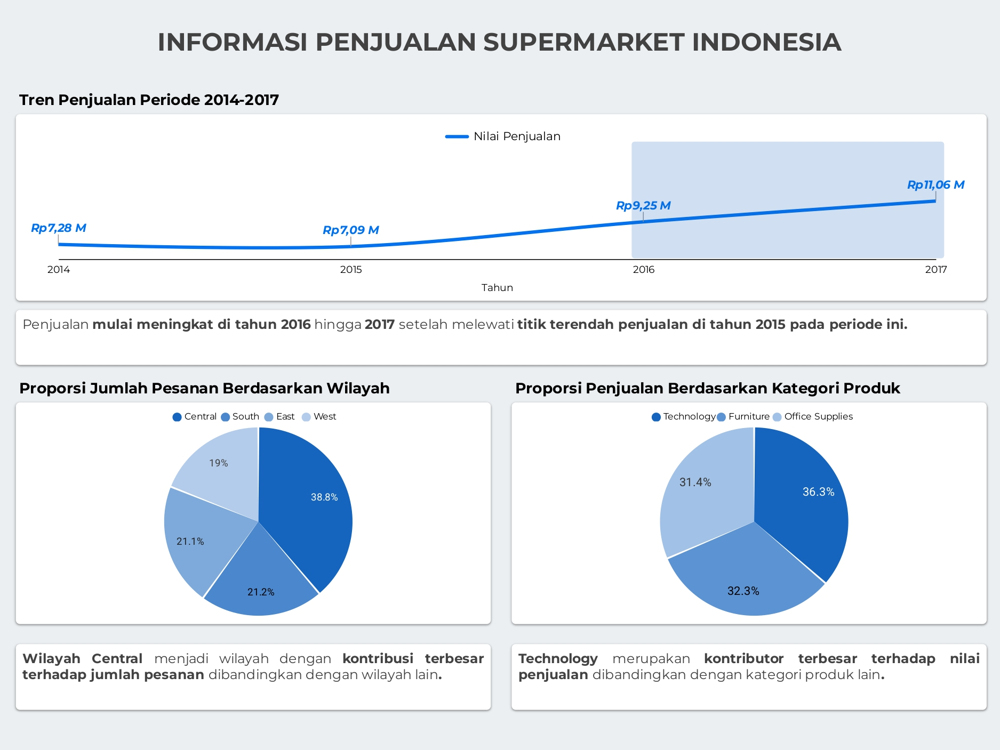
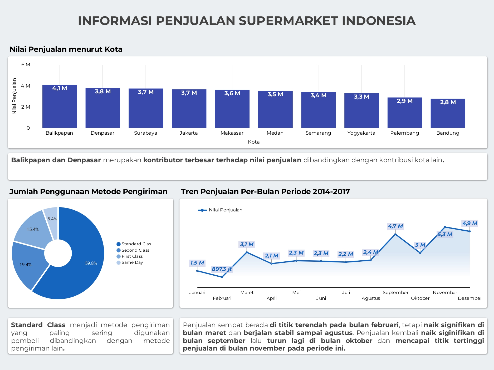

# Analisis & Prediksi Keuntungan Penjualan Supermarket Indonesia (2014–2017)

## 1. Judul Proyek & Deskripsi Singkat

**Judul Proyek:** Analisis Eksploratif dan Prediksi Keuntungan Penjualan Supermarket Indonesia (2014–2017)

Proyek ini bertujuan menjawab kebutuhan bisnis untuk memahami pola penjualan sebuah jaringan supermarket di Indonesia — mulai dari tren nilai penjualan per tahun/bulan, kontribusi wilayah dan kategori produk, hingga preferensi metode pengiriman pelanggan. Selain analisis deskriptif, proyek ini juga membangun **model prediktif keuntungan (profit)** transaksi menggunakan beberapa algoritma regresi, sehingga hasilnya dapat dipakai sebagai dasar pengambilan keputusan operasional dan strategi penjualan.

## 2. Ringkasan Temuan (Key Insights)

* **Tren penjualan naik signifikan sejak 2016.** Nilai penjualan sempat turun dari Rp7,28 M (2014) ke titik terendah Rp7,09 M (2015), lalu naik tajam menjadi Rp9,25 M (2016) dan Rp11,06 M (2017).
* **Wilayah Central mendominasi jumlah pesanan** dengan kontribusi 38,8%, jauh di atas South (21,2%), East (21,1%), dan West (19%).
* **Kategori Technology adalah kontributor pendapatan terbesar** (36,3% dari total penjualan), diikuti Furniture (32,3%) dan Office Supplies (31,4%).
* **Balikpapan dan Denpasar adalah kota dengan kontribusi penjualan tertinggi** (masing-masing Rp4,1 M dan Rp3,8 M), sementara secara rata-rata per transaksi Balikpapan tetap teratas (±Rp4,08 juta/transaksi).
* **Standard Class adalah metode pengiriman paling populer** (59,8% dari seluruh pesanan), jauh di atas Second Class (19,4%), First Class (15,4%), dan Same Day (5,4%).
* **Pola musiman:** penjualan bulanan berada di titik terendah pada Februari (Rp897,3 juta), naik signifikan di Maret, relatif stabil hingga Agustus, lalu melonjak ke puncaknya di November (Rp5,3 M) sebelum sedikit menurun di Desember (Rp4,9 M).
* **Makassar memiliki jumlah pelanggan (transaksi) terbanyak** (1.103), diikuti Surabaya (1.101) dan Denpasar (1.069), sedangkan hari **Senin** mencatat jumlah transaksi tertinggi dibanding hari lain dalam seminggu.
* **Lima produk dengan total penjualan tertinggi**: Mesin Fotokopi 5577 (Rp923,99 juta), Ordner Arsip A4 9062 (Rp411,80 juta), Mesin Laminating 5722 (Rp339,58 juta), Kursi Kantor 8559 (Rp328,06 juta), dan Binder Kancing A4 9759 (Rp297,35 juta).
* **Model prediksi keuntungan terbaik adalah Random Forest** dengan MAE 378.725 dan R² 0,673 — mengungguli Decision Tree (MAE 441.868, R² 0,495) dan Linear Regression (MAE 879.964, R² 0,203).

### Visualisasi Utama



*Dashboard di atas merangkum tren penjualan 2014–2017, proporsi pesanan per wilayah, dan proporsi penjualan per kategori produk.*



*Halaman kedua dashboard menampilkan breakdown lebih rinci:*
* *Nilai Penjualan menurut Kota* — bar chart yang menegaskan Balikpapan (Rp4,1 M) dan Denpasar (Rp3,8 M) sebagai dua kota dengan kontribusi penjualan tertinggi, diikuti Surabaya, Jakarta, Makassar, Medan, Semarang, Yogyakarta, Palembang, hingga Bandung (Rp2,8 M) sebagai kota dengan kontribusi terendah.
* *Jumlah Penggunaan Metode Pengiriman* — donut chart yang mengonfirmasi dominasi Standard Class (59,8%) dibanding Second Class (19,4%), First Class (15,4%), dan Same Day (5,4%).
* *Tren Penjualan Per-Bulan Periode 2014-2017* — line chart yang memperlihatkan pola musiman: penurunan dari Rp1,5 M (Januari) ke titik terendah Rp897,3 juta (Februari), lonjakan ke Rp3,1 M (Maret), kestabilan relatif di kisaran Rp2,1–2,4 M (April–Agustus), lonjakan tajam ke puncak Rp4,7 M (September), penurunan sementara ke Rp3 M (Oktober), lalu naik lagi hingga mencapai titik tertinggi sepanjang tahun di Rp5,3 M (November) sebelum sedikit melandai ke Rp4,9 M (Desember).

Dashboard interaktif lengkap (dengan kemampuan filter per tahun, kota, atau kategori) tersedia melalui Looker Studio — lihat tautan pada bagian [Sumber Data](#3-sumber-data-dataset).

## 3. Sumber Data (Dataset)

* **Asal data:** Data transaksi penjualan supermarket (sintetis/synthetic) untuk konteks Indonesia, diolah dan dibersihkan pada spreadsheet Google Sheets, kemudian divisualisasikan melalui dashboard Looker Studio (Data Studio).
  * Google Sheets (data mentah & hasil pembersihan): <https://docs.google.com/spreadsheets/d/1Qh5zQu0__6t6x0visi38FORtxOimMon16ALz-z30AUk/edit?usp=sharing>
  * Dashboard Looker Studio: <https://datastudio.google.com/reporting/06c5eaf7-dc9b-44d4-93a3-765fc1c04923>
* **Metadata singkat:**
  * Jumlah baris transaksi (sheet `sources`): **10.076 baris** dengan **24 kolom**.
  * Periode data: **2014 – 2017**.
  * Cakupan: transaksi penjualan ritel di 10 kota besar Indonesia (Balikpapan, Denpasar, Surabaya, Jakarta, Makassar, Medan, Semarang, Yogyakarta, Palembang, Bandung), 3 kategori produk (Technology, Furniture, Office Supplies), dan 4 wilayah (Central, South, East, West).
* **Kamus data (kolom penting pada sheet `sources`):**

  | Kolom | Keterangan |
  |---|---|
  | `order_id` | ID unik pesanan (format `IDN-YYYY-xxxxx`) |
  | `tanggal_pemesanan` / `tanggal_pengiriman` | Tanggal pesanan dibuat dan tanggal barang dikirim |
  | `clean_tanggal_pengiriman` | Versi tanggal pengiriman setelah proses pembersihan nilai kosong |
  | `metode_pengiriman` | Standard Class, Second Class, First Class, atau Same Day |
  | `customer_id`, `nama_pelanggan`, `segmen` | Identitas dan segmen pelanggan (Consumer, Corporate, Home Office) |
  | `kota`, `clean_kota` | Kota asal pesanan (versi asli dan versi setelah standardisasi nama kota) |
  | `provinsi`, `kode_pos`, `clean_kode_pos` | Data lokasi tambahan, dengan versi bersih untuk kode pos |
  | `wilayah` | Wilayah geografis (Central/South/East/West) |
  | `product_id`, `kategori`, `sub_kategori`, `nama_produk` | Detail produk yang terjual |
  | `penjualan` | Nilai penjualan (revenue) transaksi, dalam Rupiah |
  | `kuantitas` | Jumlah unit terjual |
  | `diskon` | Persentase diskon yang diberikan |
  | `keuntungan` | Keuntungan (profit) transaksi, dalam Rupiah — **variabel target** pada tahap pemodelan prediktif |

  Selain `sources`, workbook juga memuat sheet pendukung: `reference_province_to_city` & `reference_postal_code` (tabel referensi untuk mengisi nilai kota/kode pos yang kosong), `basic_analysis` & `query_analysis` (hasil query analitik), dan `top_lima_produk` (ringkasan 5 produk terlaris).

## 4. Metodologi & Alur Kerja (Workflow)

* **Pembersihan Data (Data Cleaning)** — dilakukan di Google Sheets sebelum data dianalisis:
  * Menghapus baris data duplikat.
  * Menstandardisasi inkonsistensi format pada kolom kota melalui kolom bantu `clean_kota`, dan mengisi nilai kota/kode pos yang kosong dengan mengambil data dari tabel referensi (`reference_province_to_city`, `reference_postal_code`) agar tidak memengaruhi perhitungan total maupun rata-rata pada hasil analisis.
  * Mengisi nilai kosong pada `tanggal_pengiriman` (missing value ±14% dari data) menggunakan asumsi bisnis rentang pengiriman 1–6 hari, dengan pola paling sering muncul adalah **4 hari** setelah tanggal pemesanan. Formula yang digunakan:
    ```
    =ARRAYFORMULA(IF(IFERROR(DATEDIF(C2:C,D2:D,"D"), 0)=0, C2:C+4, D2:D))
    ```
* **Analisis (EDA):**
  * Analisis tren nilai penjualan tahunan (2014–2017) dan bulanan untuk mengidentifikasi pola musiman.
  * Analisis komposisi/segmentasi berdasarkan wilayah, kategori produk, kota, dan metode pengiriman (proporsi dan agregasi menggunakan `SUM`/`AVERAGE`/`COUNT`).
  * Query analitik ad-hoc (sheet `query_analysis`) untuk menjawab pertanyaan bisnis spesifik, misalnya jumlah pelanggan per kota, rata-rata penjualan per kota, dan distribusi transaksi per hari dalam seminggu.
  * Identifikasi lima produk dengan kontribusi penjualan tertinggi sepanjang periode data.
* **Pemodelan (Predictive Modeling):**
  * Dibangun menggunakan **Orange Data Mining** (workflow `analisis-prediktif-supermarket.ows`) dengan target prediksi **keuntungan (profit)** transaksi.
  * Fitur (feature) yang digunakan: `metode_pengiriman`, `kategori`, `penjualan`, `kuantitas`, `diskon`.
  * Alur workflow: `File` (dataset) → `Select Columns` (memilih fitur & target) → `Continuize` (encoding variabel kategorikal) → `Preprocess` → dilatih paralel pada tiga model — `Linear Regression`, `Tree` (Decision Tree), dan `Random Forest` → dievaluasi bersama di `Test and Score` → hasil prediksi ditinjau di `Predictions`, dan model terbaik disimpan melalui `Save Model`.
  * Perbandingan performa model (metrik MAE & R²):

    | Peringkat | Model | MAE | R² |
    |---|---|---|---|
    | 1 | Random Forest | 378.725 | 0,673 |
    | 2 | Decision Tree | 441.868 | 0,495 |
    | 3 | Linear Regression | 879.964 | 0,203 |

    Random Forest dipilih sebagai model terbaik karena memiliki error prediksi (MAE) terendah dan kemampuan menjelaskan variasi data (R²) tertinggi di antara ketiga model yang diujicobakan.

## 5. Teknologi & Alat yang Digunakan (Tools)

* **Pengolahan & Pembersihan Data:** Google Sheets (formula `ARRAYFORMULA`, `DATEDIF`, `IFERROR`, `VLOOKUP`/tabel referensi).
* **Machine Learning / Pemodelan Prediktif:** Orange Data Mining (visual workflow: Select Columns, Continuize, Preprocess, Linear Regression, Tree, Random Forest, Test and Score, Predictions, Save Model).
* **Visualisasi / BI:** Looker Studio (Google Data Studio) untuk dashboard interaktif; Google Sheets untuk chart pendukung analisis.
* **Format Data & Ekspor:** Microsoft Excel (`.xlsx`) sebagai salinan/arsip dataset dan hasil analisis; PDF sebagai laporan ringkasan dashboard.

## 6. Cara Menjalankan Proyek (How to Run)

1. **Clone/unduh proyek ini**, pastikan seluruh berkas berikut tersedia dalam satu folder:
   * `_906__synthetic_store_indonesia.xlsx` — dataset mentah, hasil pembersihan, dan hasil query analitik.
   * `analisis-prediktif-supermarket.ows` — workflow pemodelan prediktif.
   * `informasi_penjualan_super_market_indonesia.pdf` — laporan ringkasan dashboard.
   * `url.txt` — tautan Google Sheets & dashboard Looker Studio.
2. **Membuka dan meninjau data:**
   * Buka `_906__synthetic_store_indonesia.xlsx` dengan Microsoft Excel/Google Sheets untuk meninjau sheet `sources` (data mentah), `basic_analysis` & `query_analysis` (hasil query), serta `top_lima_produk`.
   * Atau buka langsung salinan online melalui tautan Google Sheets pada `url.txt`.
3. **Menjalankan ulang pemodelan prediktif:**
   * Instal [Orange Data Mining](https://orangedatamining.com/download/) (tersedia untuk Windows/macOS/Linux, gratis).
   * Buka aplikasi Orange, lalu pilih **File → Open** dan arahkan ke `analisis-prediktif-supermarket.ows`.
   * Pastikan widget `File` menunjuk ke dataset yang benar (bila diperlukan, arahkan ulang ke sheet `sources` pada file `.xlsx`, diekspor ke CSV terlebih dahulu jika Orange tidak dapat membaca `.xlsx` langsung).
   * Jalankan workflow (klik kanan pada canvas → **Run**, atau workflow akan otomatis mengalir antar-widget) untuk melihat kembali hasil evaluasi model di widget `Test and Score` dan `Predictions`.
4. **Melihat dashboard interaktif:** buka tautan Looker Studio pada `url.txt` melalui browser untuk eksplorasi dashboard secara langsung (filter per tahun, kota, atau kategori).

## 7. Kesimpulan & Rekomendasi Bisnis

* **Perkuat kehadiran di wilayah Central dan kategori Technology**, karena keduanya adalah pendorong utama volume pesanan maupun pendapatan. Alokasi stok, promosi, dan tenaga penjualan dapat diprioritaskan pada kombinasi ini.
* **Manfaatkan momentum pertumbuhan pasca-2015** dengan mereplikasi strategi/inisiatif yang mendorong lonjakan penjualan di 2016–2017 (misalnya ekspansi produk atau promosi) ke tahun-tahun berikutnya.
* **Antisipasi pola musiman**: siapkan stok dan kapasitas operasional ekstra menjelang **November** (puncak penjualan tahunan), dan evaluasi penyebab penjualan rendah di **Februari** — apakah karena faktor musiman pasar atau kurangnya aktivitas promosi pada periode tersebut.
* **Optimalkan operasional logistik Standard Class**, mengingat metode ini digunakan pada hampir 60% pesanan; peningkatan efisiensi (kecepatan, biaya) pada jalur pengiriman ini akan berdampak besar terhadap pengalaman mayoritas pelanggan.
* **Jadikan Balikpapan dan Denpasar sebagai kota percontohan (pilot city)** untuk strategi penjualan baru sebelum diperluas ke kota lain, karena keduanya secara konsisten menjadi kontributor nilai penjualan tertinggi baik secara total maupun rata-rata per transaksi.
* **Gunakan model Random Forest yang telah dilatih (`Save Model`) sebagai alat bantu estimasi keuntungan** pada tahap perencanaan transaksi/diskon baru — meski R² 0,673 menunjukkan model cukup baik namun belum sempurna, sehingga hasil prediksi sebaiknya tetap dikombinasikan dengan pertimbangan bisnis manusia, terutama untuk kategori atau kombinasi fitur yang jarang muncul di data historis.
* **Tinjau ulang kebijakan diskon** pada kombinasi kategori/kota tertentu, mengingat `diskon` menjadi salah satu fitur penting dalam model prediksi keuntungan — indikasi bahwa diskon berlebihan berpotensi menekan margin secara signifikan.
